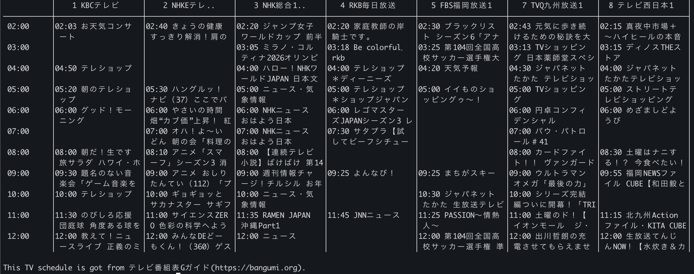

# tvshow

 

Display Japanese TV schedules in the terminal.

## Install

### Cargo

```bash
cargo install tvshow
```

### Homebrew

```bash
brew install Doarakko/tap/tvshow
```

## Usage

```bash
tvshow -h
```

```
tvshow 0.1.2

USAGE:
    tvshow [OPTIONS]

FLAGS:
    -h, --help       Prints help information
    -V, --version    Prints version information

OPTIONS:
    -a, --area <area>       [default: 東京]
    -t, --hours <hours>     [default: 12]
```

## Example

```bash
tvshow
```



## Credit

This TV schedule is got from [テレビ番組表 G ガイド](https://bangumi.org).

## Contributing

Before submitting a PR, run the CI checks locally:

```bash
# Build
cargo build --release

# Format
cargo fmt

# Lint
cargo clippy -- -D warnings
```

## Release

1. Update version in `Cargo.toml`
2. Push git tag
    ```bash
    git tag v0.1.3
    git push origin v0.1.3
    ```
3. Update Homebrew formula
    ```bash
    ./scripts/update-homebrew.sh 0.1.3
    ```

## Licence

MIT
